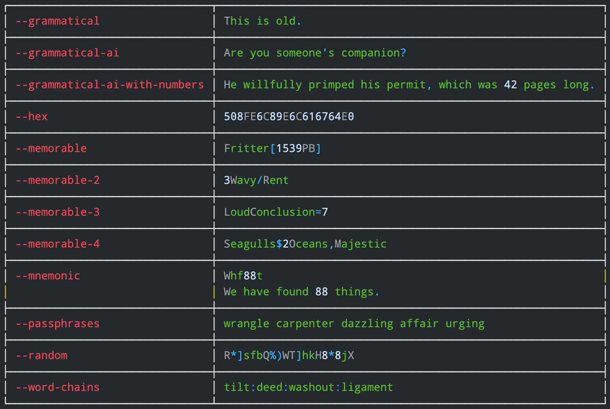

# passwordgen

This Golang-based command-line password generator with optional use of the [ChatGPT-4 API](https://platform.openai.com/docs/api-reference), generates secure passwords as well as memorable, AI-enhanced passphrases and sentences in English. These unique features provide a balance between memorability and security. The tool is cross-platform, working on Mac, Linux, Unix, and Windows.

|                                             Language                                             |                                                                                                                                                 Operating Systems                                                                                                                                                 |                                                                                                                                                                            Shell Support                                                                                                                                                                             |
|:------------------------------------------------------------------------------------------------:|:-----------------------------------------------------------------------------------------------------------------------------------------------------------------------------------------------------------------------------------------------------------------------------------------------------------------:|:--------------------------------------------------------------------------------------------------------------------------------------------------------------------------------------------------------------------------------------------------------------------------------------------------------------------------------------------------------------------:|
|  |   |   |





Table of Contents
=================

* [passwordgen](#passwordgen)
    * [Just download a binary for your platform](#just-download-a-binary-for-your-platform)
    * [Or build it from source](#or-build-it-from-source)
    * [Run](#run)
    * [Usage](#usage)
    * [Examples](#examples)
    * [Grammatical vs Grammatical-AI](#grammatical-vs-grammatical-ai)
    * [Hexadecimal PINs](#hexadecimal-pins)
    * [Memorable Passwords](#memorable-passwords)
    * [Memorable-2 Passwords](#memorable-2-passwords)
    * [Memorable-3 passwords](#memorable-3-passwords)
    * [Memorable-4 passwords](#memorable-4-passwords)
    * [Mnemonic passwords](#mnemonic-passwords)
    * [Passphrases](#passphrases)
    * [Word Chains](#word-chains)
* [Signing up for a ChatGPT-4 API key](#signing-up-for-a-chatgpt-4-api-key)
* [Setting the GPT_API_KEY environment variable](#setting-the-gpt_api_key-environment-variable)
    * [Linux, Unix, and Mac OS](#linux-unix-and-mac-os)
      * [User level and persistent](#user-level-and-persistent)
      * [System level and persistent](#system-level-and-persistent)
    * [Windows](#windows)
        * [Windows Powershell](#windows-powershell)
            * [User level and persistent](#user-level-and-persistent-1)
            * [Machine level and persistent](#machine-level-and-persistent)
        * [Windows cmd shell](#windows-cmd-shell)
            * [User level and persistent](#user-level-and-persistent-2)
            * [Machine level and persistent](#machine-level-and-persistent-1)
* [Building releases for multiple platforms](#building-releases-for-multiple-platforms)

## Just download a binary for your platform

See the [latest release binaries](https://github.com/tcpiplab/passwordgen/releases/latest) for Mac (Intel or ARM), Linux, or Windows.

## Or build it from source

```shell
$ git clone https://github.com/tcpiplab/passwordgen.git

$ cd passwordgen

$ go build passwordgen.go
```

## Run

```shell
$ ./passwordgen 20
┌───┬──────────────────────┐
│ 0 │ ]Be6ITzc%*ZpZe{]XWvY │
├───┼──────────────────────┤
│ 1 │ 3E1zUVaSw4CtU13NE]H) │
├───┼──────────────────────┤
│ 2 │ %l2VuZSt8Iu96CEB#Phm │
├───┼──────────────────────┤
│ 3 │ mkEBj!t0oW5[xU[sDSad │
├───┼──────────────────────┤
│ 4 │ hF[tKgW!QXpzUvSDt8r( │
├───┼──────────────────────┤
│ 5 │ WWTh%6fEbSm5su^JDn6b │
├───┼──────────────────────┤
│ 6 │ }oHBNXgX5FKIVE@yU8uK │
├───┼──────────────────────┤
│ 7 │ 2Lw@Z8oXq@*JxV}mI9[k │
├───┼──────────────────────┤
│ 8 │ n5NQ35DJYr3QU7*J7q8z │
└───┴──────────────────────┘
Enter an integer: 5
Input has been copied to clipboard.
Waiting for 60 seconds before clearing the clipboard.
█████████████████████████████████████████████████████████████60
```

## Usage

```shell
$ ./passwordgen -h
Usage of ./passwordgen:
  -erase
        ./passwordgen --erase[=false] (default true)
  -examples
        ./passwordgen --examples
  -grammatical
        ./passwordgen --grammatical
  -grammatical-ai
        ./passwordgen --grammatical-ai  (Requires an openai.com GPT-4 API key)
  -grammatical-ai-with-numbers
        ./passwordgen --grammatical-ai-with-numbers  (Requires an openai.com GPT-4 API key)
  -help
        ./passwordgen -h
  -hex
        ./passwordgen --hex
  -interactive
        ./passwordgen --interactive[=false] (default true)
  -memorable
        ./passwordgen --memorable
  -memorable-2
        ./passwordgen --memorable-2
  -memorable-3
        ./passwordgen --memorable-3
  -mnemonic
        ./passwordgen --mnemonic  (Requires an openai.com GPT-4 API key)
  -passphrases
        ./passwordgen --passphrases
  -random
        ./passwordgen --random (default true)
  -word-chains
        ./passwordgen --word-chains
```

## Examples 

In the examples below, notice that the trailing digit specifying length (20 in this example) is required for all commands. But the various commands comply with the length specification to varying degrees. Some are absolutely strict, others are approximate, sentences ignore it.

```shell
$ ./passwordgen --examples 15

┌───────────────────────────────┬────────────────────────────────────────────────────┐
│ --grammatical                 │ Didn't we unbearably water any opinion?            │
├───────────────────────────────┼────────────────────────────────────────────────────┤
│ --grammatical-ai              │ Don't succumb to his pressure.                     │
├───────────────────────────────┼────────────────────────────────────────────────────┤
│ --grammatical-ai-with-numbers │ Their 0 monstrous vehicles didn't cause any cases. │
├───────────────────────────────┼────────────────────────────────────────────────────┤
│ --hex                         │ 7C326D21                                           │
├───────────────────────────────┼────────────────────────────────────────────────────┤
│ --memorable                   │ {%1337}Paradox                                     │
├───────────────────────────────┼────────────────────────────────────────────────────┤
│ --memorable-2                 │ =Spinner7                                          │
├───────────────────────────────┼────────────────────────────────────────────────────┤
│ --memorable-3                 │ 4?ThatOrganises                                    │
├───────────────────────────────┼────────────────────────────────────────────────────┤
│ --memorable-4                 │ ShinyPaintbrushes~5Easels                          │
├───────────────────────────────┼────────────────────────────────────────────────────┤
│ --mnemonic                    │ Tswi28plim                                         │
│                               │ This script, which is 28 pages long, is mine.      │
├───────────────────────────────┼────────────────────────────────────────────────────┤
│ --passphrases                 │ playoff august uninstall lid tricking              │
├───────────────────────────────┼────────────────────────────────────────────────────┤
│ --random                      │ ^OV2oDK1                                           │
├───────────────────────────────┼────────────────────────────────────────────────────┤
│ --word-chains                 │ evolve*jeeringly                                   │
└───────────────────────────────┴────────────────────────────────────────────────────┘
```

## Grammatical vs Grammatical-AI

The `--grammatical`, `grammatical-ai`,`--grammatical-ai-with-numbers`, and `--mnemonic` options will each generate grammatically correct sentences for use as passphrases. But the latter three options use AI to improve the sentences and will make a lot more sense to you. Use of the AI options requires that you have a valid GPT-4 API key in an environment variable named `GPT_API_KEY`.

```shell
./passwordgen --grammatical-ai --interactive=false
┌───┬─────────────────────────────────────────┐
│ 0 │ Then, they didn't deduce.               │
├───┼─────────────────────────────────────────┤
│ 1 │ Is it time to sail?                     │
├───┼─────────────────────────────────────────┤
│ 2 │ Help the willing man.                   │
├───┼─────────────────────────────────────────┤
│ 3 │ Their impossible series didn't succeed. │
├───┼─────────────────────────────────────────┤
│ 4 │ That is through the window.             │
├───┼─────────────────────────────────────────┤
│ 5 │ Undermine my assumption.                │
├───┼─────────────────────────────────────────┤
│ 6 │ Don't leave their stupidity.            │
├───┼─────────────────────────────────────────┤
│ 7 │ He patted her well-worn bottom.         │
├───┼─────────────────────────────────────────┤
│ 8 │ Grill a united dish.                    │
└───┴─────────────────────────────────────────┘
```

```shell
./passwordgen --grammatical-ai-with-numbers --interactive=false
┌───┬──────────────────────────────────────────────────────┐
│ 0 │ Their score of 77 is not average.                    │
├───┼──────────────────────────────────────────────────────┤
│ 1 │ Cook 37 cups of rice happily.                        │
├───┼──────────────────────────────────────────────────────┤
│ 2 │ Eleven of them shall crossly brandish their fee.     │
├───┼──────────────────────────────────────────────────────┤
│ 3 │ It vehemently condemned the 96 degree climate.       │
├───┼──────────────────────────────────────────────────────┤
│ 4 │ Thirteen people encroached on someone's rain.        │
├───┼──────────────────────────────────────────────────────┤
│ 5 │ Request his help with the task of 87.                │
├───┼──────────────────────────────────────────────────────┤
│ 6 │ At 27 years old, someone's youth is theirs to enjoy. │
├───┼──────────────────────────────────────────────────────┤
│ 7 │ The subject is 42 pounds plump.                      │
├───┼──────────────────────────────────────────────────────┤
│ 8 │ Conduct 0 operations.                                │
└───┴──────────────────────────────────────────────────────┘
```

## Hexadecimal PINs

Hex pins must be 4 or more characters long.

```shell
passwordgen --hex 4
┌───┬──────┐
│ 0 │ FC70 │
├───┼──────┤
│ 1 │ DA10 │
├───┼──────┤
│ 2 │ 2DB6 │
├───┼──────┤
│ 3 │ C314 │
├───┼──────┤
│ 4 │ D186 │
├───┼──────┤
│ 5 │ 5139 │
├───┼──────┤
│ 6 │ D760 │
├───┼──────┤
│ 7 │ 5B32 │
├───┼──────┤
│ 8 │ 48F4 │
└───┴──────┘
```

## Memorable Passwords

For `--memorable` passwords, the length is only a rough guide, not deterministic. Values longer than 12 will tend to create passwords that include more than one word.

```shell
/passwordgen --memorable 12
┌───┬───────────────┐
│ 0 │ [856]Unglue   │
├───┼───────────────┤
│ 1 │ 1423(Unfazed) │
├───┼───────────────┤
│ 2 │ {Landowner}4  │
├───┼───────────────┤
│ 3 │ [552]Juror    │
├───┼───────────────┤
│ 4 │ Errand{1796}  │
├───┼───────────────┤
│ 5 │ 138[Revenge]  │
├───┼───────────────┤
│ 6 │ Groove{1768}  │
├───┼───────────────┤
│ 7 │ (Getup)1691   │
├───┼───────────────┤
│ 8 │ Cadillac{780} │
└───┴───────────────┘
```

## Memorable-2 Passwords

For `--memorable-2` passwords, the length is only a rough guide, not deterministic. Values longer than 12 will tend to create passwords that include more than one word.

```shell
./passwordgen --memorable-2 --interactive=false 20
┌───┬────────────────────────┐
│ 0 │ 3Avaricious|Cousin     │
├───┼────────────────────────┤
│ 1 │ Exalted+Level8         │
├───┼────────────────────────┤
│ 2 │ 7Vigorous$Permission   │
├───┼────────────────────────┤
│ 3 │ Elementary%Set2        │
├───┼────────────────────────┤
│ 4 │ 2Vibrant@Relative      │
├───┼────────────────────────┤
│ 5 │ 6Meek:Agency           │
├───┼────────────────────────┤
│ 6 │ %8Well-lit/Chain%      │
├───┼────────────────────────┤
│ 7 │ Affectionate`Designer6 │
├───┼────────────────────────┤
│ 8 │ Smooth=Arm9            │
└───┴────────────────────────┘
```

## Memorable-3 passwords

```shell
./passwordgen --memorable-3 --interactive=false
┌────┬─────────────────────────┐
│ 0  │ ExtrovertedClue$1918    │
├────┼─────────────────────────┤
│ 1  │ DevotedRole*12          │
├────┼─────────────────────────┤
│ 2  │ UnnaturalRoof_2015      │
├────┼─────────────────────────┤
│ 3  │ BlandSituation%00       │
├────┼─────────────────────────┤
│ 4  │ DisfiguredHoliday,2023  │
├────┼─────────────────────────┤
│ 5  │ UglySpeaker/1908        │
├────┼─────────────────────────┤
│ 6  │ IllegalTitle_99         │
├────┼─────────────────────────┤
│ 7  │ BlaringHome?11          │
├────┼─────────────────────────┤
│ 8  │ SubduedMethod@1941      │
├────┼─────────────────────────┤
│ 9  │ RegularEngineering?1976 │
├────┼─────────────────────────┤
│ 10 │ NovelNecessary;2023     │
├────┼─────────────────────────┤
│ 11 │ UnconsciousEqual'99     │
└────┴─────────────────────────┘
```

## Memorable-4 passwords

These are perhaps the most memorable type of passwords offered by this program. The constituent words are chosen by the ChatGPT-4 API. Then this program optionally pluralizes one noun, depending on the random digit generated, and adds a delimiter before concatenating it all into a password.

```shell
/passwordgen --memorable-4
┌───┬─────────────────────────────┐
│ 0 │ Trees%5Roots,Ominous        │
├───┼─────────────────────────────┤
│ 1 │ Drums%2Cymbals,Metallic     │
├───┼─────────────────────────────┤
│ 2 │ Orchid!1Petal,Fragrant      │
├───┼─────────────────────────────┤
│ 3 │ 4Clarets-ExquisiteDecanters │
├───┼─────────────────────────────┤
│ 4 │ DisgustingCats-0Litterboxes │
├───┼─────────────────────────────┤
│ 5 │ Car#1Wheel,Rotating         │
├───┼─────────────────────────────┤
│ 6 │ 3Pianos_GrandBenches        │
├───┼─────────────────────────────┤
│ 7 │ CreativeDirectors.4Actors   │
├───┼─────────────────────────────┤
│ 8 │ 5Boats:SecludedHarbors      │
└───┴─────────────────────────────┘
```

## Mnemonic passwords

The memorable sentence is generated manually but with random inputs, then improved by ChatGPT-4, which requires an API key. But the resulting mnemonic password is created deterministically by this program.

```shell
./passwordgen --mnemonic --interactive=false
┌───┬──────────────┬───────────────────────────────────────────────────────────┐
│ 0 │ Iywoywf14dwt │ If you work on your weaknesses for 14 days, will they.    │
├───┼──────────────┼───────────────────────────────────────────────────────────┤
│ 1 │ Nfo64wbataic │ No fortune of 64 will be able to alter its course.        │
├───┼──────────────┼───────────────────────────────────────────────────────────┤
│ 2 │ 76soyhsnbf   │ 76 sections of your highway should not be fragmented.     │
├───┼──────────────┼───────────────────────────────────────────────────────────┤
│ 3 │ T95-ybwriao  │ The 95-year-old bell will ring in an old.                 │
├───┼──────────────┼───────────────────────────────────────────────────────────┤
│ 4 │ G57pt        │ Give 57 people thanks.                                    │
├───┼──────────────┼───────────────────────────────────────────────────────────┤
│ 5 │ 14pwns       │ 14 purchases were not successful.                         │
├───┼──────────────┼───────────────────────────────────────────────────────────┤
│ 6 │ Hf85%i       │ Hector felt 85% insecure.                                 │
├───┼──────────────┼───────────────────────────────────────────────────────────┤
│ 7 │ Sposiist     │ Seventeen percent of someone's income is sometimes taxed. │
├───┼──────────────┼───────────────────────────────────────────────────────────┤
│ 8 │ Ismbf25m     │ I snuggled my blanket for 25 minutes.                     │
└───┴──────────────┴───────────────────────────────────────────────────────────┘
```

## Passphrases

The example below shows use of the `-passphrases` feature as well as the optional feature `-interactive=false` so that a list of passphrases is simply printed to the screen and the program exits. This example is run in Powershell on Windows 10 but works on all platforms.

```shell
PS C:\Users\somebody\Downloads> .\passwordgen-v1.3.0-windows-amd64.exe -passphrases -interactive=false
┌────┬───────────────────────────────────────────────┐
│  0 │ active stalling dubbed almighty entity        │
├────┼───────────────────────────────────────────────┤
│  1 │ tying wireless relish levitate outwit         │
├────┼───────────────────────────────────────────────┤
│  2 │ unreeling angelic camper augmented hardhat    │
├────┼───────────────────────────────────────────────┤
│  3 │ had humble polish legume external             │
├────┼───────────────────────────────────────────────┤
│  4 │ regime twilight risk outburst overarch        │
├────┼───────────────────────────────────────────────┤
│  5 │ hazing move uncle clustered dehydrate         │
├────┼───────────────────────────────────────────────┤
│  6 │ sizzling singer predict surplus debtor        │
├────┼───────────────────────────────────────────────┤
│  7 │ division imprudent tapeless unbounded console │
├────┼───────────────────────────────────────────────┤
│  8 │ replica cabbage regress detector purifier     │
├────┼───────────────────────────────────────────────┤
│  9 │ denote ancient customize tidal puppy          │
├────┼───────────────────────────────────────────────┤
│ 10 │ sworn scraggly sandstorm crayon untapped      │
├────┼───────────────────────────────────────────────┤
│ 11 │ deceiver bunny subpanel decathlon lifting     │
├────┼───────────────────────────────────────────────┤
│ 12 │ unvalued could easter polymer unlimited       │
├────┼───────────────────────────────────────────────┤
│ 13 │ legroom caretaker reference frantic genetics  │
└────┴───────────────────────────────────────────────┘
```

## Word Chains

The `--word-chains` flag requires an argument for how long the passwords will be. Each resulting password will be approximate, depending on the length of the words it is composed of. The length argument must be the last value on the command line.

```shell
./passwordgen -word-chains 20
┌───┬──────────────────────────────┐
│ 0 │ obsolete+falsify+tapping     │
├───┼──────────────────────────────┤
│ 1 │ batch=ecosystem=tribune      │
├───┼──────────────────────────────┤
│ 2 │ opponent#kindly#flagstone    │
├───┼──────────────────────────────┤
│ 3 │ comply_footwork_account      │
├───┼──────────────────────────────┤
│ 4 │ coronary+certainly+discard   │
├───┼──────────────────────────────┤
│ 5 │ pedigree&batboy&italicize    │
├───┼──────────────────────────────┤
│ 6 │ poise|unbridle|hunchback     │
├───┼──────────────────────────────┤
│ 7 │ swipe:iciness:clip:doozy     │
├───┼──────────────────────────────┤
│ 8 │ device-dreary-ranch-linoleum │
└───┴──────────────────────────────┘
```

# Signing up for a ChatGPT-4 API key

You can sign up for a ChatGPT-4 API key [here](https://platform.openai.com/signup). It will cost you a little bit of money each time you use it. At the time of this writing it is pretty cheap. For example, so far it has cost me less than $3.00 to develop and test all the AI features of this program. And they allow you to set soft and hard limits so that you don't accidentally spend to much money.


# Setting the `GPT_API_KEY` environment variable 

This is optional. But some of the most interesting features of this tool require this environment variable in order to make calls to the ChatGPT-4 API. Without it these features won't work:

- `--examples`
- `--grammatical-ai`
- `--grammatical-ai-with-numbers`
- `--memorable-4`
- `--mnemonic`

## Linux, Unix, and Mac OS

The examples below are for if you're using the `zsh` shell. If you're not using the `zsh` shell, the `~/.zshrc` file should be replaced with whichever file is appropriate for the shell you're using and how your shell is set up. If you're using the `zsh` shell, then just follow the example below. If you're using the `bash` shell then here's the rule of thumb:

- If you want your changes to be available in all shell sessions (both login and non-login), place them in `~/.bashrc` and make sure that your `~/.bash_profile` sources your `~/.bashrc` file. This is usually already set up for you by the OS install scripts.
- If you want your changes to only apply to login shells (like when you ssh into your machine), put them in `~/.bash_profile`.

If you're using another shell like `ksh`, `tcsh`, `csh`, or `sh`, then I'm sure you know exactly what you're doing and can figure out how to set environment variables with no problem.

#### User level and persistent


```shell
echo 'export GPT_API_KEY=xx-xxxxxxxxxxxxxxxxxxxxxxxxxxxxxxx' >> ~/.zshrc
source ~/.zshrc
```

#### System level and persistent

You'll have to do this as root or use `sudo`. Either way, I assume that you know what you're doing if you have this level of authorization.

```shell
sudo echo 'export GPT_API_KEY=xx-xxxxxxxxxxxxxxxxxxxxxxxxxxxxxxx' > /etc/profile.d/myenvvars.sh
```

## Windows

### Windows Powershell

#### User level and persistent

To set a permanent environment variable that persists across sessions and reboots, you can use the `[System.Environment]::SetEnvironmentVariable()` method. For example, to set a user-level environment variable use the following command but replace the `xx-xxxxxxxx...` key value with your own key value. Leave the `User` field just like you see below:

```shell
[System.Environment]::SetEnvironmentVariable("GPT_API_KEY", "xx-xxxxxxxxxxxxxxxxxxxxxxxxxxxxxxx", "User")
```

After setting this permanent environment variable, you need to restart your PowerShell session for the changes to take effect.

#### Machine level and persistent

To set a machine-level (system-wide) environment variable you need to run PowerShell with administrative privileges. Leave the `Machine` field just like you see below:

```shell
[System.Environment]::SetEnvironmentVariable("GPT_API_KEY", "xx-xxxxxxxxxxxxxxxxxxxxxxxxxxxxxxx", "Machine")
```

Now restart your computer for the changes to take effect.

### Windows cmd shell

#### User level and persistent

```shell
setx GPT_API_KEY "xx-xxxxxxxxxxxxxxxxxxxxxxxxxxxxxxx"
```

Now close your `cmd` window and open another one. 

#### Machine level and persistent

To set a system-wide environment variable (as opposed to a user-specific one), you need to run the `cmd` shell as an administrator and use the `/M` switch:

```shell
setx /M GPT_API_KEY "xx-xxxxxxxxxxxxxxxxxxxxxxxxxxxxxxx"
```

Now close your `cmd` window and open another one. For other users to use the environment variable you may have to reboot.

# Building releases for multiple platforms

```shell
GOOS=darwin GOARCH=arm64 go build -o Release-Binaries/v1.9.x/passwordgen-v1.9.0-darwin-arm64
GOOS=darwin GOARCH=amd64 go build -o Release-Binaries/v1.9.x/passwordgen-v1.9.0-darwin-amd64
GOOS=windows GOARCH=amd64 go build -o Release-Binaries/v1.9.x/passwordgen-v1.9.0-windows-amd64.exe
GOOS=linux GOARCH=amd64 go build -o Release-Binaries/v1.9.x/passwordgen-v1.9.0-linux-amd64
```